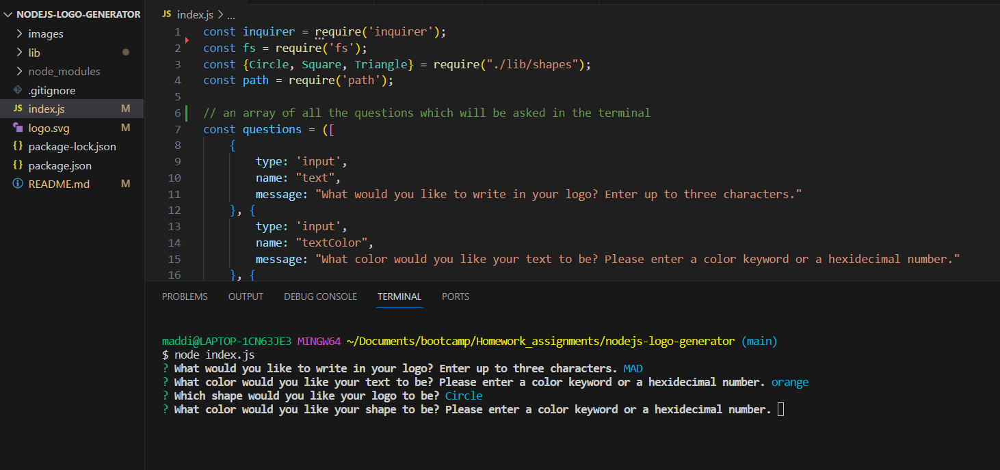
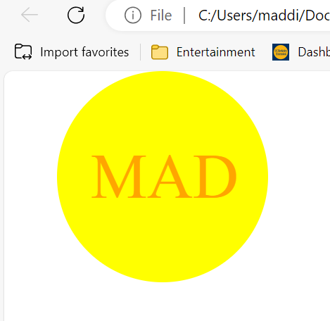
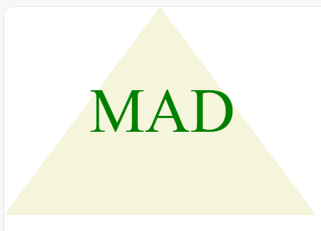

# nodejs-logo-generator

## Description

This application provides a simple logo in a SVG file by after a user answers a few question prompts in the terminal. This application was built to help a user build an original logo without having to pay for someone to design it. By answering only four questions in the terminal to output a new logo, it also saves the user time. In building this project I was able to practice using inquirer and jest, and better learn how to write tests for my code.

## Table of Contents

- [Installation](#installation)
- [Usage](#usage)
- [Credits](#credits)
- [Tests](#tests)

## Installation

For this project, a user will have to download the code that I have written and have inquirer 8.2.4 and jest installed.

## Usage

To use, run the command "node index.js" in the terminal. Answer the questions as they are prompted. Once all of the questions have been answered, a file named logo.svg will be created which will display the logo generated for the user based on their input. Please see screenshots below for examples of answering the prompted questions in the terminal, as well as an example for a generated logo.

## Credits

I used the following links to assist in building this application:

- https://coding-boot-camp.github.io/full-stack/github/professional-readme-guide
- https://developer.mozilla.org/en-US/docs/Web/SVG/Tutorial/Basic_Shapes
- https://developer.mozilla.org/en-US/docs/Web/SVG/Tutorial/Texts 

## Tests

To run the tests written on shapes.text.js file, run the command "jest" in the terminal.